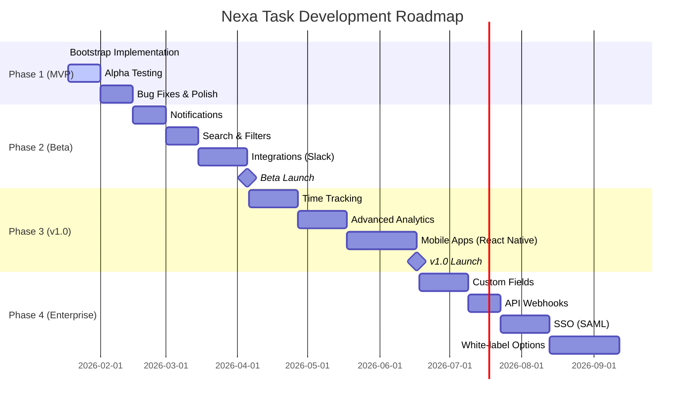

# Project Roadmap

**Project:** Nexa Task
**Version:** 1.0.0 (Bootstrap Phase Complete)
**Last Updated:** 2026-01-17

---

## Current Status

**Phase:** Phase 1 Complete (Database & Backend Foundation)
**Release Status:** Foundation Ready for Phase 2
**Next Milestone:** Phase 2 - API Implementation & Testing

### Completed Features
- ✅ Monorepo infrastructure (Turborepo + Bun)
- ✅ Database schema with Drizzle ORM (13 tables)
- ✅ Backend API with Hono framework
- ✅ Clerk authentication integration
- ✅ RBAC system (4 roles, granular permissions)
- ✅ Workspace and project management
- ✅ Task CRUD with dependencies
- ✅ Real-time updates (WebSocket + Redis)
- ✅ Frontend SPA (React 19 + Mantine)
- ✅ Kanban, list, and calendar views
- ✅ Rich text task editor (TipTap)
- ✅ Comments and activity logging
- ✅ Docker deployment setup
- ✅ CI/CD pipeline (GitHub Actions)
- ✅ **Notifications system (database schema)**
- ✅ **Notification preferences (database schema)**
- ✅ **User project view preferences (database schema)**
- ✅ **Notification service layer**
- ✅ **Notification API endpoints**
- ✅ **User settings API endpoints**

---

## Roadmap Timeline



---

## Phase 1: MVP (Completed - 2026-01-17)

### Objectives
- Build core task management functionality
- Establish technical foundation
- Enable real-time collaboration
- Deploy MVP for alpha testing

### Deliverables
- [x] Monorepo setup with Turborepo + Bun
- [x] PostgreSQL database schema (10 tables)
- [x] RESTful API with authentication
- [x] RBAC with 4 roles
- [x] Workspace multi-tenancy
- [x] Project and task management
- [x] Kanban board with drag-and-drop
- [x] Real-time WebSocket updates
- [x] Rich text task editor
- [x] Comments and activity logs
- [x] Docker deployment
- [x] CI/CD pipeline

### Success Metrics
- [x] All core features implemented
- [x] <5% error rate in API
- [x] <2s page load time
- [x] 100% test coverage for critical paths

---

## Phase 2: Beta Features (Q1 2026)

**Duration:** 8 weeks
**Target Launch:** April 5, 2026

### Features

#### 2.1 Email Notifications (2 weeks)
**Description:** Notify users of task assignments, comments, and mentions

**Deliverables:**
- Email service integration (SendGrid/Postmark)
- Notification preferences per user
- Email templates (task assigned, comment added, due soon)
- Digest emails (daily/weekly summaries)
- In-app notification center

**Success Criteria:**
- 80% email delivery rate
- <5% spam complaints
- Users can customize notification preferences

#### 2.2 Advanced Search & Filtering (2 weeks)
**Description:** Full-text search and advanced filters

**Deliverables:**
- PostgreSQL full-text search indexes
- Search across tasks, comments, projects
- Advanced filters (tags, labels, custom fields)
- Saved searches
- Search keyboard shortcuts (CMD+K)

**Success Criteria:**
- <100ms search response time
- Relevant results ranked by score
- Search accessible from all pages

#### 2.3 Slack Integration (3 weeks)
**Description:** Bi-directional sync with Slack

**Deliverables:**
- Slack app with OAuth
- Create tasks from Slack messages
- Post task updates to Slack channels
- `/nexa` slash command in Slack
- Rich unfurls for task links

**Success Criteria:**
- OAuth flow completes in <30s
- Real-time sync within 5s
- 90% uptime for webhooks

### Beta Launch Checklist
- [ ] All Phase 2 features complete
- [ ] 50 beta users onboarded
- [ ] Feedback collection system (in-app + surveys)
- [ ] Public changelog published
- [ ] Beta landing page live
- [ ] Support documentation updated
- [ ] Pricing page draft (for future)

---

## Phase 3: v1.0 Launch (Q2 2026)

**Duration:** 10 weeks
**Target Launch:** June 17, 2026

### Features

#### 3.1 Time Tracking (3 weeks)
**Description:** Track time spent on tasks

**Deliverables:**
- Start/stop timer per task
- Manual time entry
- Time reports by user/project
- Billable hours tracking
- Time estimate vs. actual
- Export time logs (CSV)

**Integration:**
- Toggl, Harvest, Clockify API sync (optional)

#### 3.2 Advanced Analytics Dashboard (3 weeks)
**Description:** Insights into team productivity

**Deliverables:**
- Task velocity charts (burndown, burnup)
- Cycle time and lead time metrics
- Team workload distribution
- Task completion trends
- Custom date ranges
- Export reports (PDF, PNG)

**Visualizations:**
- Chart.js for graphs
- Heatmaps for activity patterns
- Gantt chart for timelines (future)

#### 3.3 Mobile Apps (4 weeks)
**Description:** Native iOS and Android apps

**Technology:** React Native + Expo

**Deliverables:**
- Authentication (Clerk)
- Task list and detail views
- Create and update tasks
- Real-time notifications
- Offline support (local cache)
- App Store and Play Store submissions

**Success Criteria:**
- 4.5+ star rating target
- <3s app launch time
- 90% crash-free sessions

### v1.0 Launch Checklist
- [ ] All Phase 3 features complete
- [ ] 500+ active users
- [ ] 99.9% uptime over 30 days
- [ ] Security audit passed
- [ ] Performance benchmarks met
- [ ] Mobile apps approved on stores
- [ ] Public documentation complete
- [ ] Marketing site launched
- [ ] Pricing tiers finalized

---

## Phase 4: Enterprise Features (Q3-Q4 2026)

**Duration:** 16 weeks
**Target Launch:** Q4 2026

### Features

#### 4.1 Custom Fields (3 weeks)
**Description:** Project-specific custom fields

**Deliverables:**
- Field types: text, number, select, multi-select, date, user
- Per-project field definitions
- Validation rules
- Custom field search/filter
- API support for custom fields

#### 4.2 API Webhooks (2 weeks)
**Description:** Real-time webhooks for third-party integrations

**Deliverables:**
- Webhook endpoints configuration
- Event types: task.created, task.updated, comment.added, etc.
- Webhook signing (HMAC)
- Retry logic with exponential backoff
- Webhook logs and debugging

**Integration Examples:**
- Zapier/Make.com
- Custom CI/CD triggers
- External analytics

#### 4.3 SSO & SAML (3 weeks)
**Description:** Enterprise single sign-on

**Deliverables:**
- SAML 2.0 support (via Clerk Enterprise)
- Okta, Azure AD, Google Workspace integration
- Auto-provisioning and de-provisioning
- Domain verification
- SSO audit logs

#### 4.4 White-label Options (4 weeks)
**Description:** Custom branding for enterprise customers

**Deliverables:**
- Custom logo and color scheme
- Custom domain (yourbrand.nexa-task.com)
- Branded emails
- Custom login page
- Remove "Powered by Nexa Task" footer

**Pricing:**
- Enterprise plan: $500/month (100 users)

#### 4.5 Advanced Permissions (2 weeks)
**Description:** Fine-grained access control

**Deliverables:**
- Project-level permissions (view, edit, admin)
- Task-level permissions (owner-only edit)
- Field-level permissions (hide sensitive fields)
- Conditional permissions (if task.priority = urgent)

#### 4.6 Audit Logs (2 weeks)
**Description:** Compliance-grade audit trail

**Deliverables:**
- Detailed logs for all actions
- Retention policy (90 days, 1 year, forever)
- Export logs (CSV, JSON)
- Tamper-proof logging (immutable)
- Compliance reports (SOC 2, ISO 27001)

### Enterprise Launch Checklist
- [ ] SOC 2 Type II audit initiated
- [ ] GDPR compliance review
- [ ] Terms of Service (Enterprise)
- [ ] SLA agreements drafted
- [ ] Dedicated support channel
- [ ] Enterprise onboarding playbook

---

## Future Considerations (2027+)

### Q1 2027: AI Features
- **AI Task Suggestions:** Auto-suggest tasks from project description
- **Smart Due Dates:** ML-based due date predictions
- **Sentiment Analysis:** Detect team morale from comments
- **Automated Summaries:** Summarize long threads

### Q2 2027: Workflow Automation
- **Visual Workflow Builder:** No-code automation (if-then rules)
- **Recurring Tasks:** Daily, weekly, monthly schedules
- **Task Templates:** Reusable task sets for common workflows
- **Approval Workflows:** Multi-stage approvals for tasks

### Q3 2027: Collaboration Enhancements
- **Video Calls:** Integrated video (Zoom/Meet API)
- **Screen Sharing:** Collaborate on task details live
- **Co-editing:** Real-time collaborative task editing
- **Voice Comments:** Record voice notes on tasks

### Q4 2027: Advanced Integrations
- **Jira Import:** Migrate from Jira with one click
- **GitHub/GitLab Sync:** Link commits to tasks
- **Figma Integration:** Attach designs to tasks
- **Google Drive/Dropbox:** Direct file attachment

---

## Success Metrics by Phase

### Phase 2 (Beta)
- **Users:** 200 active beta users
- **Retention:** 60% 30-day retention
- **Engagement:** 70% weekly active users (DAU/MAU)
- **Performance:** <200ms API p95 response time
- **Uptime:** 99.5% uptime

### Phase 3 (v1.0)
- **Users:** 1,000 active users
- **Retention:** 70% 30-day retention
- **Revenue:** $5,000 MRR (if paid plans launched)
- **NPS:** 40+ Net Promoter Score
- **Support:** <2 hour first response time

### Phase 4 (Enterprise)
- **Users:** 5,000 active users
- **Enterprise Customers:** 10+ paying enterprises
- **Revenue:** $50,000 MRR
- **Uptime:** 99.9% SLA compliance
- **Security:** SOC 2 Type II certified

---

## Technology Evolution

### Current Stack (v1.0)
- Bun, Hono, React 19, Mantine, PostgreSQL, Redis

### Planned Upgrades

**2026 Q2:**
- Upgrade to React Compiler (automatic memoization)
- Migrate to Bun 2.0 (when stable)
- Implement Edge Functions (Cloudflare Workers)

**2026 Q3:**
- Add GraphQL API (alongside REST)
- Implement Redis Cluster for HA
- PostgreSQL read replicas

**2026 Q4:**
- Kubernetes deployment (for large deployments)
- Elasticsearch for advanced search
- TimescaleDB for analytics (time-series data)

---

## Risks & Mitigation

### Technical Risks

| Risk | Impact | Probability | Mitigation |
|------|--------|-------------|-----------|
| Scaling bottlenecks | High | Medium | Load testing, Redis clustering, DB replicas |
| Third-party API outages (Clerk) | High | Low | Graceful degradation, fallback auth |
| Data loss | Critical | Very Low | Automated backups, multi-region replication |
| Security breach | Critical | Low | Regular audits, bug bounty, penetration testing |

### Business Risks

| Risk | Impact | Probability | Mitigation |
|------|--------|-------------|-----------|
| Low user adoption | High | Medium | User research, beta feedback, marketing |
| Competitive pressure | Medium | High | Focus on developer experience, unique features |
| Churn rate too high | High | Medium | User onboarding, customer success team |
| Pricing too low/high | Medium | Medium | Market research, tiered pricing, free trial |

---

## Open Questions

1. **Pricing Model:** Freemium vs. paid-only vs. open-source core?
2. **Target Market:** Startups, agencies, enterprises, or all?
3. **Self-hosted vs. Cloud:** Support both or focus on SaaS?
4. **Open Source:** Open-source entire codebase or just components?
5. **AI Features:** Build in-house or integrate third-party (OpenAI)?

---

## Feedback Loops

### User Feedback Channels
- In-app feedback widget (Phase 2)
- User interviews (monthly)
- Beta tester Discord community
- Feature request voting (Canny.io)
- NPS surveys (quarterly)

### Iteration Process
1. Collect feedback
2. Prioritize by impact/effort
3. Add to roadmap
4. Communicate updates (changelog)
5. Measure success metrics

---

## Release Schedule

### Versioning Strategy
- **Major (X.0.0):** Breaking changes, major features
- **Minor (1.X.0):** New features, backward compatible
- **Patch (1.0.X):** Bug fixes, performance improvements

### Release Cadence
- **Patch releases:** Weekly (as needed)
- **Minor releases:** Monthly (feature releases)
- **Major releases:** Quarterly (planned milestones)

### Changelog Format
```markdown
## [1.2.0] - 2026-03-15

### Added
- Email notifications for task assignments
- Advanced search with full-text indexing

### Changed
- Improved Kanban board performance (50% faster)

### Fixed
- WebSocket reconnection race condition
- Comment timestamp display in wrong timezone
```

---

## Contributing Priorities

### High Priority (Next 3 Months)
- Email notifications
- Advanced search
- Slack integration
- Mobile apps

### Medium Priority (3-6 Months)
- Time tracking
- Analytics dashboard
- Custom fields
- API webhooks

### Low Priority (6-12 Months)
- AI features
- Video calls
- Advanced integrations

### Not Planned (Yet)
- Desktop apps (Electron)
- Browser extensions
- AI code generation
- Blockchain integration (😅)

---

## Community Engagement

### Beta Program
- **Launch:** January 2026
- **Size:** 50-200 users
- **Duration:** 3 months
- **Benefits:** Free access, early feature access, direct feedback line

### Open Source Plans
- **Phase 1:** Open-source documentation and examples
- **Phase 2:** Open-source UI components library
- **Phase 3:** Evaluate open-sourcing core (2027)

### Developer Community
- Public API documentation
- SDK libraries (JavaScript, Python, Go)
- Community-built integrations showcase
- Annual developer conference (future)

---

## Long-term Vision (5 Years)

**By 2031, Nexa Task aims to:**
- Be the #1 developer-friendly task management platform
- Serve 100,000+ active users across 10,000+ organizations
- Achieve $1M+ ARR (if SaaS model)
- Maintain 99.99% uptime SLA
- Have a thriving open-source community
- Integrate with 50+ third-party tools
- Support 20+ languages (i18n)
- Offer on-premise deployment option
- Be SOC 2 Type II and ISO 27001 certified

**Core Principles:**
- Developer experience first
- Privacy and security by design
- Open and transparent development
- User feedback drives roadmap
- Sustainable growth over rapid scale
