# System Architecture

**Project:** Nexa Task
**Version:** 1.0.0
**Last Updated:** 2026-01-17

---

## Architecture Overview

Nexa Task follows a modern, scalable architecture with clear separation of concerns:

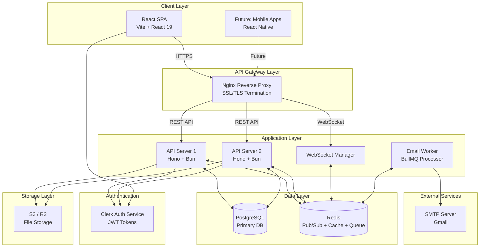

---

## Component Architecture

### Frontend Architecture

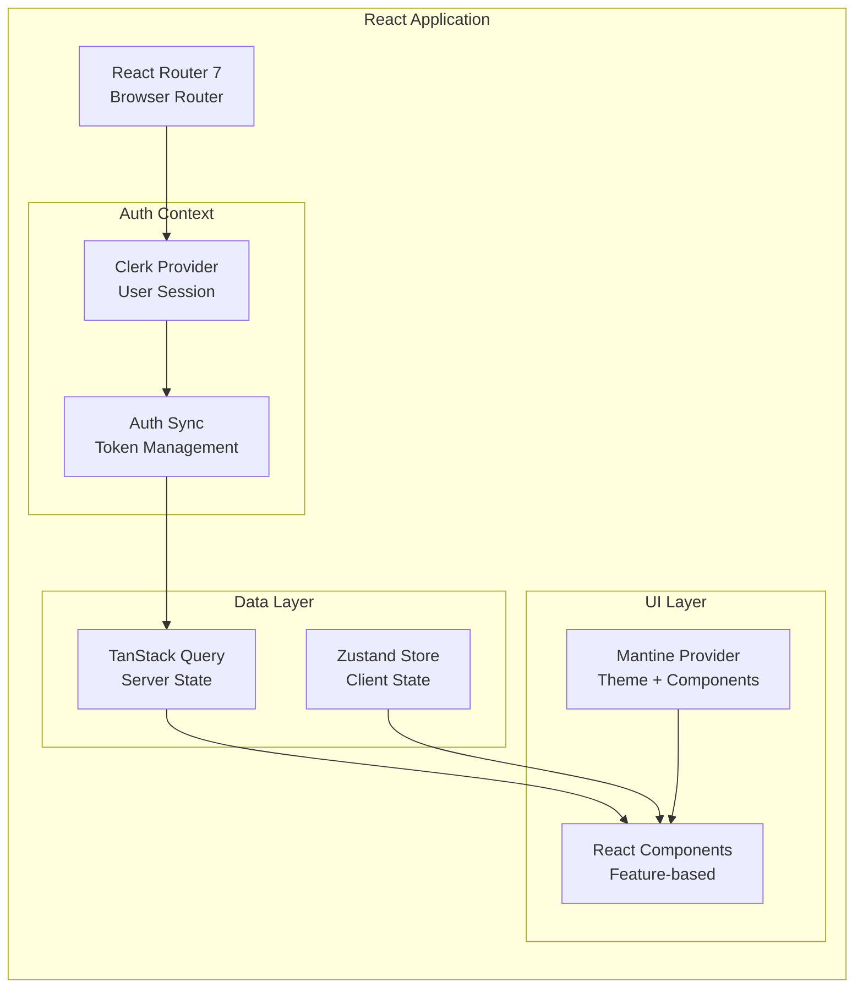

**Key Design Patterns:**

1. **Container/Presentational Components**
   - Containers: Data fetching with hooks
   - Presentational: Pure display components

2. **Custom Hooks Pattern**
   - `use-tasks.ts` - Task CRUD operations
   - `use-projects.ts` - Project management
   - `use-workspace.ts` - Workspace context

3. **CSS Layers**
   ```css
   @layer theme, base, mantine, components, utilities;
   ```
   - Prevents style conflicts
   - Mantine + Tailwind coexistence

4. **Optimistic Updates**
   ```typescript
   const moveTask = useMutation({
     onMutate: async (newTask) => {
       // Cancel outgoing queries
       await queryClient.cancelQueries(['tasks']);

       // Snapshot current state
       const previous = queryClient.getQueryData(['tasks']);

       // Optimistically update
       queryClient.setQueryData(['tasks'], (old) =>
         updateTaskInList(old, newTask)
       );

       return { previous };
     },
     onError: (err, newTask, context) => {
       // Rollback on error
       queryClient.setQueryData(['tasks'], context.previous);
     },
   });
   ```

---

### Backend Architecture

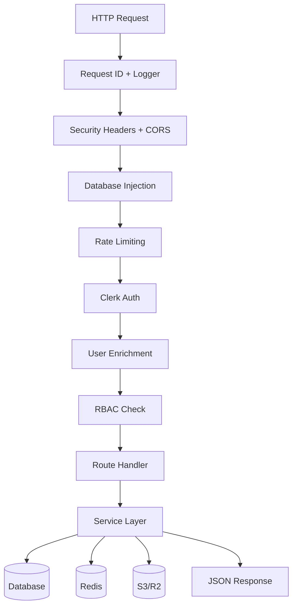

**Layered Architecture:**

1. **Middleware Chain**
   - Global: Logging, CORS, security headers
   - Database: Inject Drizzle client into context
   - Auth: Clerk JWT validation + user sync
   - RBAC: Permission enforcement

2. **Routes (Thin Controllers)**
   - Input validation (Zod)
   - Delegate to services
   - Format responses

3. **Services (Business Logic)**
   - Database operations
   - Activity logging
   - File uploads
   - Real-time broadcasts

4. **Database (Drizzle ORM)**
   - Type-safe queries
   - Relational queries with `with`
   - Transactions for consistency

**Example Flow: Create Task**

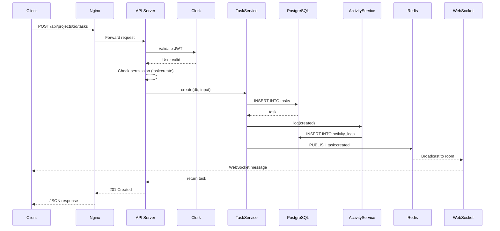

---

## Database Architecture

### Schema Design

```mermaid
erDiagram
    USERS ||--o{ WORKSPACE_MEMBERS : belongs
    USERS ||--o{ WORKSPACES : owns
    USERS ||--o{ TASKS : creates
    USERS ||--o{ TASKS : assigned
    USERS ||--o{ COMMENTS : writes
    USERS ||--o{ NOTIFICATIONS : receives
    USERS ||--|| NOTIFICATION_PREFERENCES : has
    USERS ||--o{ USER_PROJECT_PREFERENCES : has

    WORKSPACES ||--o{ WORKSPACE_MEMBERS : has
    WORKSPACES ||--o{ PROJECTS : contains

    PROJECTS ||--o{ TASKS : contains
    PROJECTS ||--o{ WORKFLOW_STATUSES : defines
    PROJECTS ||--o{ USER_PROJECT_PREFERENCES : configured_for

    TASKS }o--|| WORKFLOW_STATUSES : has
    TASKS ||--o{ TASK_DEPENDENCIES : blocks
    TASKS ||--o{ TASK_WATCHERS : watched_by
    TASKS ||--o{ COMMENTS : has
    TASKS ||--o{ ATTACHMENTS : has
    TASKS ||--o{ NOTIFICATIONS : triggers

    USERS {
        uuid id PK
        text clerk_id UK
        text email UK
        text name
        text avatar_url
        timestamp created_at
    }

    WORKSPACES {
        uuid id PK
        text clerk_org_id UK
        text name
        text slug UK
        uuid owner_id FK
        jsonb settings
        timestamp created_at
    }

    PROJECTS {
        uuid id PK
        uuid workspace_id FK
        text name
        text description
        enum status
        uuid created_by_id FK
        timestamp created_at
    }

    TASKS {
        uuid id PK
        uuid project_id FK
        uuid status_id FK
        text title
        text description
        enum priority
        uuid assignee_id FK
        uuid created_by_id FK
        int order
        timestamp due_date
        timestamp completed_at
        timestamp created_at
    }

    NOTIFICATIONS {
        uuid id PK
        uuid user_id FK
        enum type
        text title
        text message
        jsonb data
        enum entity_type
        uuid entity_id
        boolean read
        timestamp read_at
        timestamp created_at
    }

    NOTIFICATION_PREFERENCES {
        uuid id PK
        uuid user_id FK UK
        boolean email_enabled
        boolean inapp_enabled
        text[] enabled_types
        timestamp created_at
        timestamp updated_at
    }

    USER_PROJECT_PREFERENCES {
        uuid id PK
        uuid user_id FK
        uuid project_id FK
        enum view_mode
        timestamp created_at
        timestamp updated_at
    }
```

### Indexing Strategy

**Primary Indexes:**
- All PKs (UUID)
- Unique constraints (clerkId, email, slug, clerkOrgId)

**Foreign Key Indexes:**
- workspaceId, projectId, statusId (most queries filter by these)
- userId, assigneeId (user-centric queries)

**Composite Indexes:**
```sql
-- Frequently queried together
CREATE INDEX tasks_project_status_idx ON tasks(project_id, status_id);
CREATE INDEX tasks_assignee_completed_idx ON tasks(assignee_id, completed_at);

-- Comment ordering
CREATE INDEX comments_task_created_idx ON comments(task_id, created_at DESC);

-- Activity logs
CREATE INDEX activity_workspace_created_idx ON activity_logs(workspace_id, created_at DESC);
```

### Data Consistency

**Transaction Examples:**
```typescript
// Move task with activity logging
await db.transaction(async (tx) => {
  // Update task
  await tx.update(tasks)
    .set({ statusId: newStatusId, order: newOrder })
    .where(eq(tasks.id, taskId));

  // Log activity
  await tx.insert(activityLogs).values({
    entityType: "task",
    entityId: taskId,
    action: "moved",
    changes: { oldStatus, newStatus },
  });
});
```

**Cascade Deletes:**
- Workspace deleted → Projects, Members cascade
- Project deleted → Tasks, Statuses cascade
- Task deleted → Comments, Attachments, Dependencies cascade

**Soft Deletes:**
- Projects: status = 'deleted'
- Allows recovery and audit trail

---

## Real-time Architecture

### WebSocket Communication

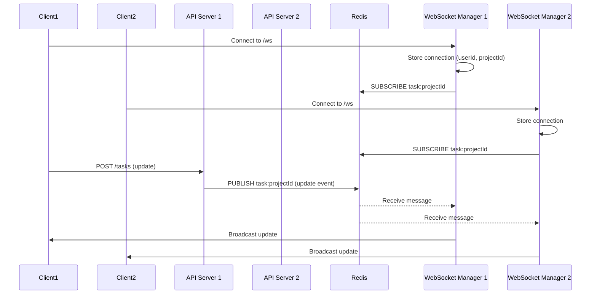

### WebSocket Manager Design

**Connection Management:**
```typescript
class WebSocketManager {
  private connections = new Map<string, Set<WebSocket>>();

  joinRoom(userId: string, room: string, ws: WebSocket) {
    if (!this.connections.has(room)) {
      this.connections.set(room, new Set());
    }
    this.connections.get(room)!.add(ws);
  }

  broadcast(room: string, message: object, excludeUserId?: string) {
    const sockets = this.connections.get(room) || new Set();
    for (const ws of sockets) {
      if (ws.readyState === WebSocket.OPEN) {
        ws.send(JSON.stringify(message));
      }
    }
  }
}
```

**Redis Pub/Sub:**
```typescript
// Subscriber client listens for events
redisSubscriber.subscribe("task:project-123", (message) => {
  const event = JSON.parse(message);
  wsManager.broadcast("task:project-123", event);
});

// Publisher emits events after DB changes
await redisPublisher.publish(
  `task:${projectId}`,
  JSON.stringify({ type: "task:update", payload: task })
);
```

**Presence Tracking:**
```typescript
interface PresenceMessage {
  type: "presence:join" | "presence:leave";
  userId: string;
  projectId: string;
  timestamp: string;
}

// Broadcast when user joins/leaves project view
wsManager.broadcast(`presence:${projectId}`, {
  type: "presence:join",
  userId,
  projectId,
  timestamp: new Date().toISOString(),
});
```

---

## Authentication & Authorization

### Authentication Flow

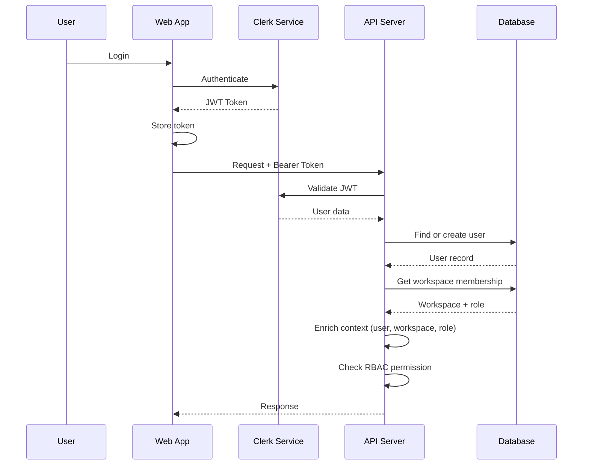

### RBAC System

**Permission Hierarchy:**
```typescript
const ROLE_PERMISSIONS = {
  super_admin: [
    "workspace:*",
    "project:*",
    "task:*",
    "comment:*",
  ],
  pm: [
    "workspace:invite",
    "project:*",
    "task:*",
    "comment:*",
  ],
  member: [
    "task:create",
    "task:update:own",
    "comment:*",
  ],
  guest: [
    "comment:create",
    "comment:update:own",
  ],
};
```

**Middleware Enforcement:**
```typescript
export const requirePermission = (permission: string) => {
  return async (c: Context, next: Next) => {
    const user = c.var.user;
    if (!hasPermission(user.role, permission)) {
      throw new ForbiddenError(`Permission ${permission} required`);
    }
    await next();
  };
};
```

---

## File Storage Architecture

### Upload Flow

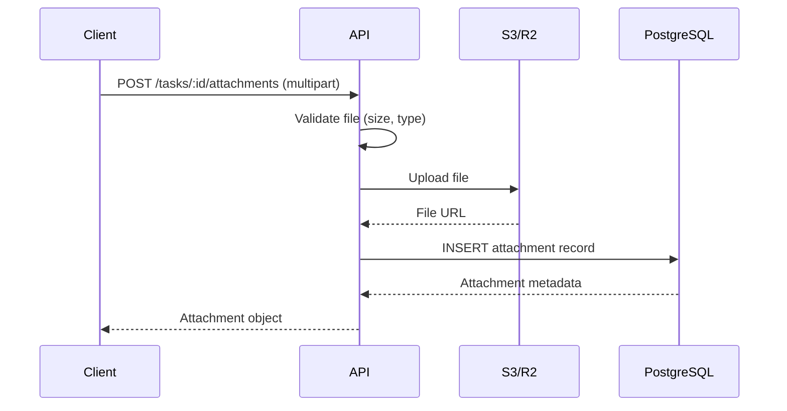

**Storage Strategy:**
- **Development:** Local filesystem or MinIO
- **Production:** S3 or Cloudflare R2
- **CDN:** CloudFront or Cloudflare CDN for downloads

**File Organization:**
```
bucket/
├── workspaces/
│   ├── {workspaceId}/
│   │   ├── tasks/
│   │   │   ├── {taskId}/
│   │   │   │   ├── {uuid}-filename.ext
```

**Security:**
- Pre-signed URLs for uploads (future)
- Access control via API (check task permissions)
- Virus scanning (future)

---

## Email Infrastructure Architecture

### Email Processing Flow

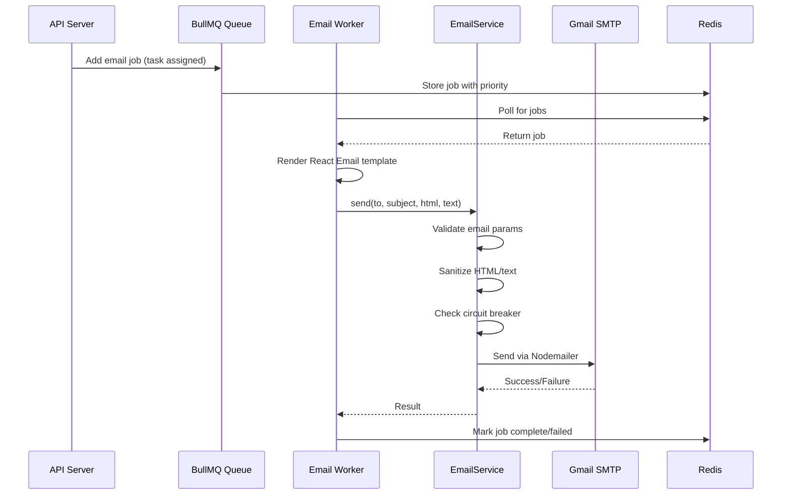

### Email Service (`EmailService` class)

**Features:**
1. **Circuit Breaker Pattern**
   - Prevents cascading failures
   - Opens after 5 consecutive failures
   - Half-open after 30s timeout
   - Resets on successful send

2. **Connection Pooling**
   - Max 5 SMTP connections
   - Reuses connections for efficiency
   - Graceful cleanup on shutdown

3. **Validation & Sanitization**
   - Required: `to`, `subject`, `html` or `text`
   - DOMPurify for HTML sanitization
   - Plain text sanitization (trim, normalize)

4. **Error Handling**
   - Structured logging with full context
   - Differentiates transient vs. permanent errors
   - Throws on validation errors (prevents retry)

### Queue System (`BullMQ`)

**Configuration:**
```typescript
const emailQueue = new Queue("email", {
  connection: redis,
  defaultJobOptions: {
    attempts: 3,
    backoff: { type: "exponential", delay: 5000 },
    removeOnComplete: { age: 3600 }, // 1 hour TTL
    removeOnFail: false, // Keep for debugging
  },
  limiter: {
    max: 100, // Max jobs per duration
    duration: 300000, // 5 minutes
  },
});
```

**Job Options:**
- **Priority:** 1-10 (higher = sooner)
- **JobId:** For idempotency (prevents duplicate emails)
- **Attempts:** 3 retries with exponential backoff (5s, 15s, 45s)
- **TTL:** Completed jobs removed after 1 hour

### Email Worker

**Responsibilities:**
1. Poll BullMQ queue for email jobs
2. Render React Email templates to HTML/text
3. Send via `EmailService`
4. Log errors with full context
5. Retry on transient failures (SMTP timeouts, network errors)

**Environment Variables:**
```bash
# SMTP Configuration
SMTP_HOST=smtp.gmail.com
SMTP_PORT=587
SMTP_SECURE=false
SMTP_REQUIRE_TLS=true
SMTP_USER=your@email.com
SMTP_PASS=your_app_password
SMTP_FROM=noreply@nexa-task.com
SMTP_POOL_SIZE=5

# Rate Limiting
EMAIL_RATE_LIMIT_MAX=100
EMAIL_RATE_LIMIT_DURATION_MS=300000
```

### Email Templates (React Email)

**Structure:**
```
packages/shared/src/email-templates/
├── base-layout.tsx         # Shared layout
├── task-assigned.tsx       # Task assignment
├── task-updated.tsx        # Task update
└── comment-added.tsx       # New comment
```

**Design Principles:**
- Responsive HTML (works in all email clients)
- Inline CSS (no external stylesheets)
- Plain text fallback
- Action buttons with deep links
- Consistent branding (logo, colors)

### Scaling Considerations

1. **Multiple Workers**
   - Run multiple worker processes
   - BullMQ ensures job distribution
   - No duplicate processing (idempotency)

2. **Rate Limiting**
   - Prevents SMTP throttling
   - 100 emails per 5 minutes (configurable)
   - Priority queue for urgent emails

3. **Circuit Breaker**
   - Prevents SMTP overload
   - Opens on repeated failures
   - Auto-recovery after timeout

4. **Redis Persistence**
   - Jobs survive worker crashes
   - AOF (Append-Only File) enabled
   - Dead letter queue for failed jobs

---

## Caching Strategy

### Multi-layer Caching

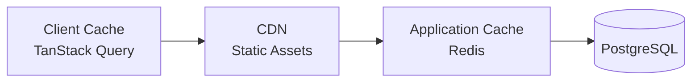

**Cache Layers:**

1. **Client (TanStack Query):**
   - Cache time: 5 minutes
   - Stale time: 1 minute
   - Automatic refetch on focus

2. **Redis (Application):**
   - User sessions: 1 hour TTL
   - Workspace settings: 10 minutes TTL
   - Task lists: Invalidated on mutations

3. **CDN (Static Assets):**
   - Immutable assets: 1 year
   - HTML: No cache (SPA)

**Cache Invalidation:**
```typescript
// After task update
await redis.del(`tasks:project:${projectId}`);
await redis.del(`tasks:user:${userId}`);

// Client-side
queryClient.invalidateQueries({ queryKey: ["tasks", projectId] });
```

---

## Scalability Architecture

### Horizontal Scaling

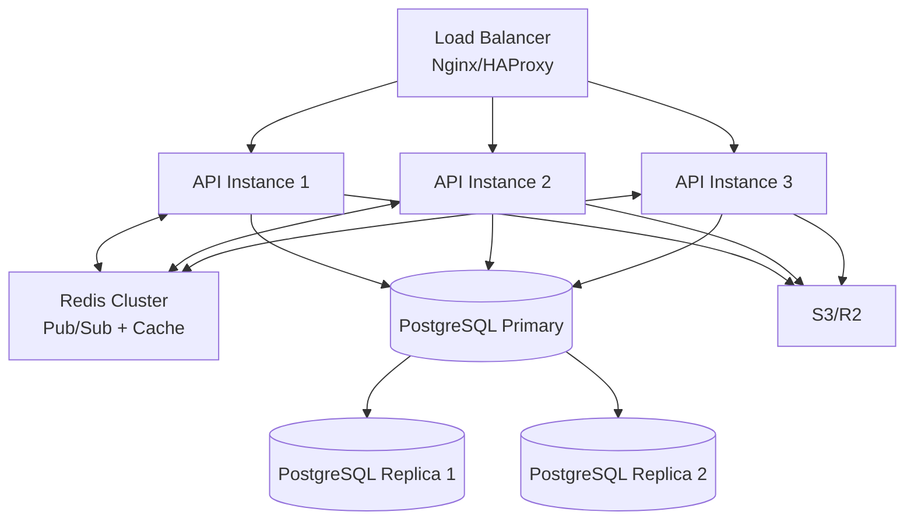

**Key Strategies:**

1. **Stateless API Servers**
   - No in-memory session storage
   - All state in Redis/PostgreSQL
   - Allows seamless scaling

2. **Redis for Coordination**
   - WebSocket message broadcasting
   - Session storage
   - Cache layer
   - Job queue (BullMQ for email workers)

3. **Database Read Replicas**
   - Route read queries to replicas
   - Write queries to primary
   - Reduce primary load

4. **Connection Pooling**
   ```typescript
   // Drizzle pool config
   const pool = new Pool({
     connectionString: process.env.DATABASE_URL,
     max: 20, // Max connections per instance
     idleTimeoutMillis: 30000,
   });
   ```

---

## Deployment Architecture

### Production Deployment

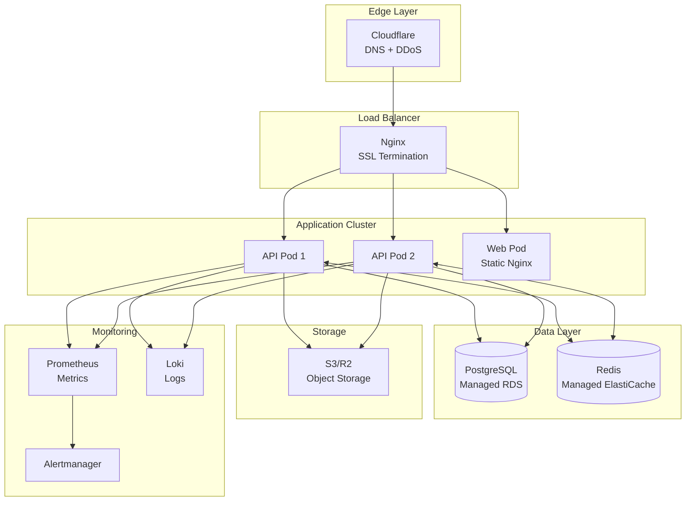

### Docker Architecture

**Multi-stage API Build:**
```dockerfile
FROM oven/bun:1.2 AS base
WORKDIR /app

# Prune monorepo
FROM base AS pruner
COPY . .
RUN bunx turbo prune @repo/api --docker

# Install dependencies
FROM base AS installer
COPY --from=pruner /app/out/json/ .
RUN bun install --frozen-lockfile --production

# Build
FROM base AS builder
COPY --from=pruner /app/out/full/ .
COPY --from=installer /app/node_modules ./node_modules
RUN bun run build

# Production runner
FROM base AS runner
RUN addgroup --system --gid 1001 app
RUN adduser --system --uid 1001 app
USER app
COPY --from=builder /app/apps/api/dist ./dist
EXPOSE 3001
CMD ["bun", "run", "dist/index.js"]
```

**Web Static Build:**
```dockerfile
FROM node:20-alpine AS builder
WORKDIR /app
COPY . .
RUN npm run build

FROM nginx:alpine AS runner
COPY --from=builder /app/dist /usr/share/nginx/html
COPY nginx.conf /etc/nginx/nginx.conf
EXPOSE 80
CMD ["nginx", "-g", "daemon off;"]
```

---

## Monitoring & Observability

### Metrics to Track

**Application Metrics:**
- Request rate (req/s)
- Response time (p50, p95, p99)
- Error rate (%)
- WebSocket connections (active)

**Infrastructure Metrics:**
- CPU/Memory usage per pod
- Database connections (active/idle)
- Redis cache hit rate
- Disk I/O

**Business Metrics:**
- Active users (DAU/MAU)
- Tasks created/completed per day
- Average task completion time
- Workspace growth rate

### Health Checks

```typescript
// API health endpoint
app.get("/health", (c) => {
  return c.json({
    status: "healthy",
    timestamp: new Date().toISOString(),
    checks: {
      database: await checkDatabase(),
      redis: await checkRedis(),
    },
  });
});
```

---

## Security Architecture

### Defense in Depth

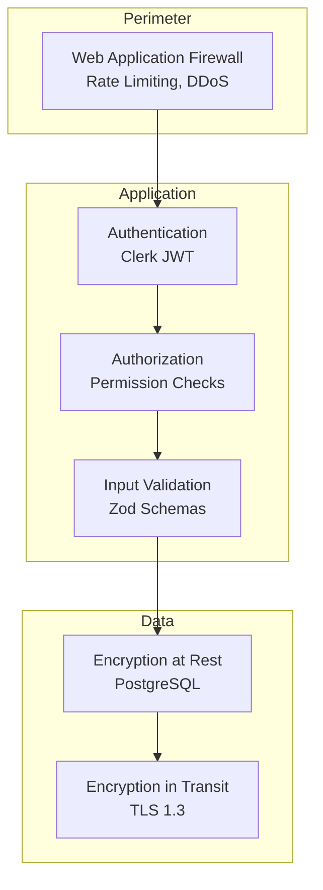

**Security Measures:**

1. **Authentication:** Clerk handles password security, MFA, SSO
2. **Authorization:** RBAC enforced on every route
3. **Input Validation:** Zod schemas, max lengths, type checks
4. **SQL Injection:** Drizzle ORM with parameterized queries
5. **XSS:** React auto-escapes, CSP headers
6. **CSRF:** SameSite cookies, CORS configuration
7. **Rate Limiting:** 100 req/min per IP
8. **Secrets Management:** Environment variables, never committed

---

## Disaster Recovery

### Backup Strategy

**Database Backups:**
- Automated daily snapshots
- Point-in-time recovery (7 days)
- Cross-region replication (production)

**Redis Persistence:**
- AOF (Append-Only File) enabled
- Snapshot every 6 hours

**File Storage:**
- S3 versioning enabled
- Cross-region replication

### Recovery Procedures

**RTO (Recovery Time Objective):** 4 hours
**RPO (Recovery Point Objective):** 1 hour

**Failover Steps:**
1. Promote PostgreSQL replica to primary
2. Update API connection strings
3. Restart API pods
4. Verify health checks
5. DNS cutover if needed

---

## Performance Optimization

### Database Optimization

1. **Query Optimization:**
   - Use `with` for joins instead of multiple queries
   - Add composite indexes for frequent query patterns
   - Use `EXPLAIN ANALYZE` for slow queries

2. **Connection Pooling:**
   - Max 20 connections per API instance
   - Idle timeout: 30 seconds

3. **Read Replicas:**
   - Route analytics queries to replicas
   - Keep transactional queries on primary

### Frontend Optimization

1. **Code Splitting:**
   ```typescript
   const ProjectDetail = lazy(() => import("./routes/project-detail"));
   ```

2. **Asset Optimization:**
   - Vite build: minification, tree-shaking
   - Image compression
   - CDN for static assets

3. **React Performance:**
   - Virtualized lists for large datasets
   - Debounced search inputs
   - Memoized expensive computations

---

## Technology Choices Rationale

| Technology | Reason |
|------------|--------|
| Bun | 4x faster than Node.js, native TypeScript, excellent DX |
| Hono | Lightweight, edge-compatible, excellent TypeScript support |
| Drizzle ORM | Type-safe, SQL-like queries, excellent performance |
| React 19 | Latest features, concurrent rendering, React Compiler ready |
| Mantine | Comprehensive components, excellent theming, accessibility |
| TanStack Query | Best-in-class server state management, optimistic updates |
| Clerk | Managed auth, reduces security burden, excellent DX |
| PostgreSQL | ACID compliance, JSON support, proven reliability |
| Redis | Fast pub/sub, caching, session storage |
| Turborepo | Fast builds, intelligent caching, excellent monorepo support |
| Docker | Consistent environments, easy deployment, horizontal scaling |
